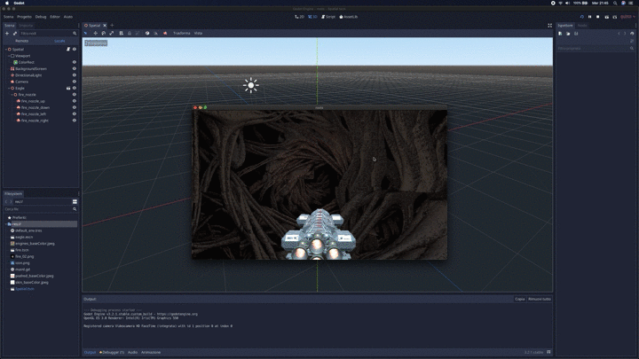
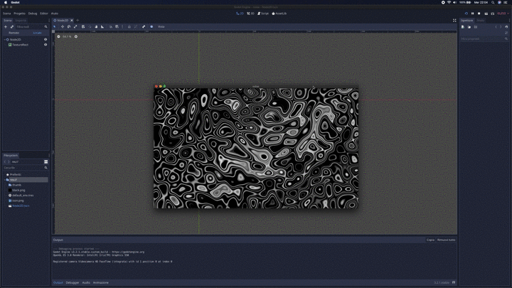
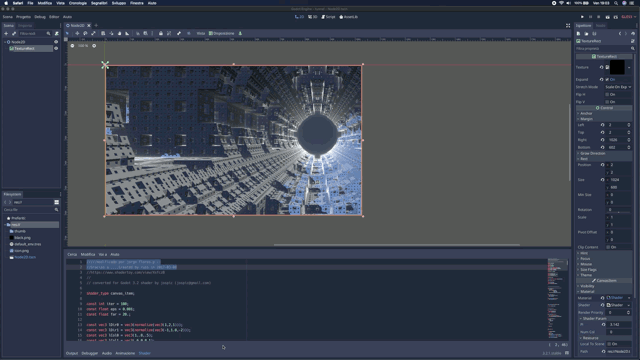
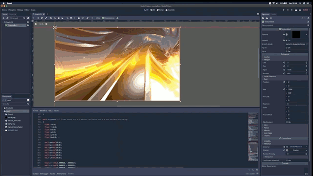
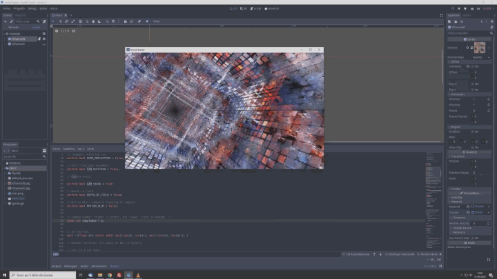

# godot3_shaders
Experiments on Godot3 shaders. Some original shaders are taken from the [ShaderToy](https://www.shadertoy.com/) and [The Book of Shaders](https://thebookofshaders.com/) sites and converted in according to Godot's Shader API.
For a brief guide on how to migrate from ShaderToy to Godot 3 look here: https://github.com/jospic/godot3_shaders/tree/master/sea-water

<table><tr><td>
   </td><td>  </td></tr><tr><td>   	  	
   </td><td>  </td></tr><tr><td>  	  	  	
    </td> <td>   	</td></tr>
  <tr><td>  	  	  	
    </td> <td>   	</td></tr>
  <tr><td>  	  	  	
    </td> <td>  	</td></tr>
  <tr><td>  	  	  	
    </td> <td> </td></tr>
  
  
  
  </table> 	   	  	

Donations
---------
Was this project useful for you? Wanna make a donation? These are the options:

### Paypal

My [Paypal donation link](https://www.paypal.me/donatejospic?locale.x=it_IT)
