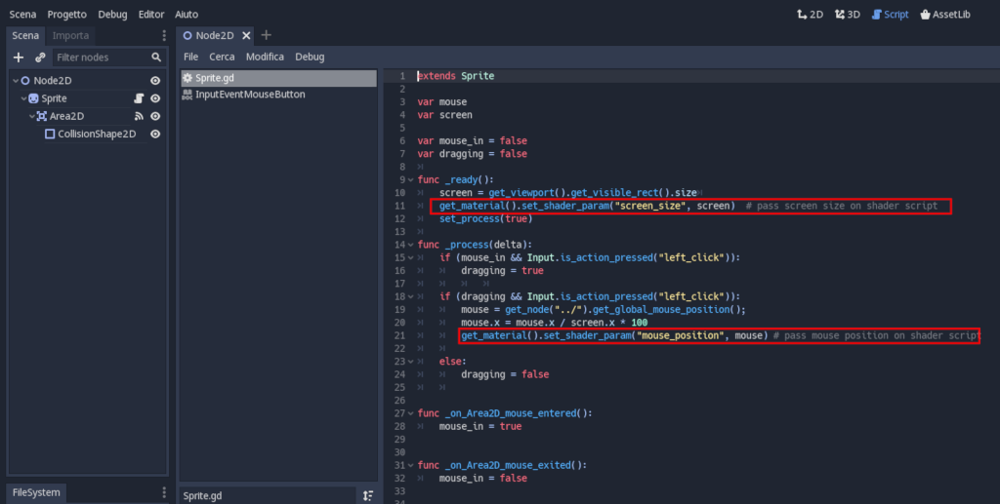

# Sea water example

This is a converted demo for Godot 3 from original example by ShaderToy https://www.shadertoy.com/view/Ms2SD1


# How-to migrating from ShaderToy to Godot 3
## Introduction
Godot uses a shading language based on GLSL with the addition of a few quality-of-life features. Accordingly, most features available in GLSL are available in Godot’s shading language.

Shadertoy is a website that makes it easy to write fragment shaders and create pure magic.
Shadertoy does not give the user full control over the shader. It handles all the input and uniforms and only lets the user write the fragment shader.

## Original ShaderToy example fragment
Following code is this original example shader from ShaderToy.

```glsl
/*
 * "Seascape" by Alexander Alekseev aka TDM - 2014
 * License Creative Commons Attribution-NonCommercial-ShareAlike 3.0 Unported License.
 * Contact: tdmaav@gmail.com
 */

const int NUM_STEPS = 8;
const float PI      = 3.141592;
const float EPSILON = 1e-3;
#define EPSILON_NRM (0.1 / iResolution.x)

// sea
const int ITER_GEOMETRY = 3;
const int ITER_FRAGMENT = 5;
const float SEA_HEIGHT = 0.6;
const float SEA_CHOPPY = 4.0;
const float SEA_SPEED = 0.8;
const float SEA_FREQ = 0.16;
const vec3 SEA_BASE = vec3(0.1,0.19,0.22);
const vec3 SEA_WATER_COLOR = vec3(0.8,0.9,0.6);
#define SEA_TIME (1.0 + iTime * SEA_SPEED)
const mat2 octave_m = mat2(1.6,1.2,-1.2,1.6);

// math
mat3 fromEuler(vec3 ang) {
	vec2 a1 = vec2(sin(ang.x),cos(ang.x));
    vec2 a2 = vec2(sin(ang.y),cos(ang.y));
    vec2 a3 = vec2(sin(ang.z),cos(ang.z));
    mat3 m;
    m[0] = vec3(a1.y*a3.y+a1.x*a2.x*a3.x,a1.y*a2.x*a3.x+a3.y*a1.x,-a2.y*a3.x);
	m[1] = vec3(-a2.y*a1.x,a1.y*a2.y,a2.x);
	m[2] = vec3(a3.y*a1.x*a2.x+a1.y*a3.x,a1.x*a3.x-a1.y*a3.y*a2.x,a2.y*a3.y);
	return m;
}
float hash( vec2 p ) {
	float h = dot(p,vec2(127.1,311.7));	
    return fract(sin(h)*43758.5453123);
}
float noise( in vec2 p ) {
    vec2 i = floor( p );
    vec2 f = fract( p );	
	vec2 u = f*f*(3.0-2.0*f);
    return -1.0+2.0*mix( mix( hash( i + vec2(0.0,0.0) ), 
                     hash( i + vec2(1.0,0.0) ), u.x),
                mix( hash( i + vec2(0.0,1.0) ), 
                     hash( i + vec2(1.0,1.0) ), u.x), u.y);
}

// lighting
float diffuse(vec3 n,vec3 l,float p) {
    return pow(dot(n,l) * 0.4 + 0.6,p);
}
float specular(vec3 n,vec3 l,vec3 e,float s) {    
    float nrm = (s + 8.0) / (PI * 8.0);
    return pow(max(dot(reflect(e,n),l),0.0),s) * nrm;
}

// sky
vec3 getSkyColor(vec3 e) {
    e.y = max(e.y,0.0);
    return vec3(pow(1.0-e.y,2.0), 1.0-e.y, 0.6+(1.0-e.y)*0.4);
}

// sea
float sea_octave(vec2 uv, float choppy) {
    uv += noise(uv);        
    vec2 wv = 1.0-abs(sin(uv));
    vec2 swv = abs(cos(uv));    
    wv = mix(wv,swv,wv);
    return pow(1.0-pow(wv.x * wv.y,0.65),choppy);
}

float map(vec3 p) {
    float freq = SEA_FREQ;
    float amp = SEA_HEIGHT;
    float choppy = SEA_CHOPPY;
    vec2 uv = p.xz; uv.x *= 0.75;
    
    float d, h = 0.0;    
    for(int i = 0; i < ITER_GEOMETRY; i++) {        
    	d = sea_octave((uv+SEA_TIME)*freq,choppy);
    	d += sea_octave((uv-SEA_TIME)*freq,choppy);
        h += d * amp;        
    	uv *= octave_m; freq *= 1.9; amp *= 0.22;
        choppy = mix(choppy,1.0,0.2);
    }
    return p.y - h;
}

float map_detailed(vec3 p) {
    float freq = SEA_FREQ;
    float amp = SEA_HEIGHT;
    float choppy = SEA_CHOPPY;
    vec2 uv = p.xz; uv.x *= 0.75;
    
    float d, h = 0.0;    
    for(int i = 0; i < ITER_FRAGMENT; i++) {        
    	d = sea_octave((uv+SEA_TIME)*freq,choppy);
    	d += sea_octave((uv-SEA_TIME)*freq,choppy);
        h += d * amp;        
    	uv *= octave_m; freq *= 1.9; amp *= 0.22;
        choppy = mix(choppy,1.0,0.2);
    }
    return p.y - h;
}

vec3 getSeaColor(vec3 p, vec3 n, vec3 l, vec3 eye, vec3 dist) {  
    float fresnel = clamp(1.0 - dot(n,-eye), 0.0, 1.0);
    fresnel = pow(fresnel,3.0) * 0.65;
        
    vec3 reflected = getSkyColor(reflect(eye,n));    
    vec3 refracted = SEA_BASE + diffuse(n,l,80.0) * SEA_WATER_COLOR * 0.12; 
    
    vec3 color = mix(refracted,reflected,fresnel);
    
    float atten = max(1.0 - dot(dist,dist) * 0.001, 0.0);
    color += SEA_WATER_COLOR * (p.y - SEA_HEIGHT) * 0.18 * atten;
    
    color += vec3(specular(n,l,eye,60.0));
    
    return color;
}

// tracing
vec3 getNormal(vec3 p, float eps) {
    vec3 n;
    n.y = map_detailed(p);    
    n.x = map_detailed(vec3(p.x+eps,p.y,p.z)) - n.y;
    n.z = map_detailed(vec3(p.x,p.y,p.z+eps)) - n.y;
    n.y = eps;
    return normalize(n);
}

float heightMapTracing(vec3 ori, vec3 dir, out vec3 p) {  
    float tm = 0.0;
    float tx = 1000.0;    
    float hx = map(ori + dir * tx);
    if(hx > 0.0) return tx;   
    float hm = map(ori + dir * tm);    
    float tmid = 0.0;
    for(int i = 0; i < NUM_STEPS; i++) {
        tmid = mix(tm,tx, hm/(hm-hx));                   
        p = ori + dir * tmid;                   
    	float hmid = map(p);
		if(hmid < 0.0) {
        	tx = tmid;
            hx = hmid;
        } else {
            tm = tmid;
            hm = hmid;
        }
    }
    return tmid;
}

// main
void mainImage( out vec4 fragColor, in vec2 fragCoord ) {
	vec2 uv = fragCoord.xy / iResolution.xy;
    uv = uv * 2.0 - 1.0;
    uv.x *= iResolution.x / iResolution.y;    
    float time = iTime * 0.3 + iMouse.x*0.01;
        
    // ray
    vec3 ang = vec3(sin(time*3.0)*0.1,sin(time)*0.2+0.3,time);    
    vec3 ori = vec3(0.0,3.5,time*5.0);
    vec3 dir = normalize(vec3(uv.xy,-2.0)); dir.z += length(uv) * 0.15;
    dir = normalize(dir) * fromEuler(ang);
    
    // tracing
    vec3 p;
    heightMapTracing(ori,dir,p);
    vec3 dist = p - ori;
    vec3 n = getNormal(p, dot(dist,dist) * EPSILON_NRM);
    vec3 light = normalize(vec3(0.0,1.0,0.8)); 
             
    // color
    vec3 color = mix(
        getSkyColor(dir),
        getSeaColor(p,n,light,dir,dist),
    	pow(smoothstep(0.0,-0.05,dir.y),0.3));
        
    // post
	fragColor = vec4(pow(color,vec3(0.75)), 1.0);
}
```
## Converted Godot 3 shader fragment
Following code is the final fragmente converted for Godot 3.

```glsl {.line-numbers}
/*
 * "Seascape" by Alexander Alekseev aka TDM - 2014
 * License Creative Commons Attribution-NonCommercial-ShareAlike 3.0 Unported License.
 * Contact: tdmaav@gmail.com
 *
 * converted for Godot 3 shader by jospic (jospic@gmail.com)
 */

shader_type canvas_item;

uniform vec2 mouse_position;
uniform vec2 screen_size;

uniform int NUM_STEPS = 8;
uniform float PI      = 3.141592;
uniform float EPSILON = 1e-3;

float EPSILON_NRM(){
	return  0.1 / screen_size.x;
}

// sea
uniform int ITER_GEOMETRY = 3;
uniform int ITER_FRAGMENT = 5;
uniform float SEA_HEIGHT = 0.6;
uniform float SEA_CHOPPY = 4.0;
uniform float SEA_SPEED = 0.8;
uniform float SEA_FREQ = 0.16;
uniform vec3 SEA_BASE = vec3(0.1,0.19,0.22);
uniform vec3 SEA_WATER_COLOR = vec3(0.8,0.9,0.6);

float SEA_TIME(float TIME) {
	return (1.0 + TIME * SEA_SPEED);
}

uniform mat2 octave_m = mat2(vec2(1.6,1.2),vec2(-1.2,1.6));

// math
mat3 fromEuler(vec3 ang) {
	vec2 a1 = vec2(sin(ang.x),cos(ang.x));
    vec2 a2 = vec2(sin(ang.y),cos(ang.y));
    vec2 a3 = vec2(sin(ang.z),cos(ang.z));
    mat3 m;
    m[0] = vec3(a1.y*a3.y+a1.x*a2.x*a3.x,a1.y*a2.x*a3.x+a3.y*a1.x,-a2.y*a3.x);
	m[1] = vec3(-a2.y*a1.x,a1.y*a2.y,a2.x);
	m[2] = vec3(a3.y*a1.x*a2.x+a1.y*a3.x,a1.x*a3.x-a1.y*a3.y*a2.x,a2.y*a3.y);
	return m;
}
float hash( vec2 p ) {
	float h = dot(p,vec2(127.1,311.7));	
    return fract(sin(h)*43758.5453123);
}
float noise( in vec2 p ) {
    vec2 i = floor( p );
    vec2 f = fract( p );	
	vec2 u = f*f*(3.0-2.0*f);
    return -1.0+2.0*mix( mix( hash( i + vec2(0.0,0.0) ), 
                     hash( i + vec2(1.0,0.0) ), u.x),
                mix( hash( i + vec2(0.0,1.0) ), 
                     hash( i + vec2(1.0,1.0) ), u.x), u.y);
}

// lighting
float diffuse(vec3 n,vec3 l,float p) {
    return pow(dot(n,l) * 0.4 + 0.6,p);
}
float specular(vec3 n,vec3 l,vec3 e,float s) {    
    float nrm = (s + 8.0) / (PI * 8.0);
    return pow(max(dot(reflect(e,n),l),0.0),s) * nrm;
}

// sky
vec3 getSkyColor(vec3 e) {
    e.y = max(e.y,0.0);
    return vec3(pow(1.0-e.y,2.0), 1.0-e.y, 0.6+(1.0-e.y)*0.4);
}

// sea
float sea_octave(vec2 uv, float choppy) {
    uv += noise(uv);        
    vec2 wv = 1.0-abs(sin(uv));
    vec2 swv = abs(cos(uv));    
    wv = mix(wv,swv,wv);
    return pow(1.0-pow(wv.x * wv.y,0.65),choppy);
}

float map(vec3 p, float TIME) {
	
    float freq = SEA_FREQ;
    float amp = SEA_HEIGHT;
    float choppy = SEA_CHOPPY;
    vec2 uv = p.xz; uv.x *= 0.75;
    
    float d, h = 0.0;    
    for(int i = 0; i < ITER_GEOMETRY; i++) {        
    	d = sea_octave((uv+SEA_TIME(TIME))*freq,choppy);
    	d += sea_octave((uv-SEA_TIME(TIME))*freq,choppy);
        h += d * amp;        
    	uv *= octave_m; freq *= 1.9; amp *= 0.22;
        choppy = mix(choppy,1.0,0.2);
    }
    return p.y - h;
}

float map_detailed(vec3 p, float TIME) {
	
    float freq = SEA_FREQ;
    float amp = SEA_HEIGHT;
    float choppy = SEA_CHOPPY;
    vec2 uv = p.xz; uv.x *= 0.75;
    
    float d, h = 0.0;    
    for(int i = 0; i < ITER_FRAGMENT; i++) {        
    	d = sea_octave((uv+SEA_TIME(TIME))*freq,choppy);
    	d += sea_octave((uv-SEA_TIME(TIME))*freq,choppy);
        h += d * amp;        
    	uv *= octave_m; freq *= 1.9; amp *= 0.22;
        choppy = mix(choppy,1.0,0.2);
    }
    return p.y - h;
}

vec3 getSeaColor(vec3 p, vec3 n, vec3 l, vec3 eye, vec3 dist) {  
    float fresnel = clamp(1.0 - dot(n,-eye), 0.0, 1.0);
    fresnel = pow(fresnel,3.0) * 0.65;
        
    vec3 reflected = getSkyColor(reflect(eye,n));    
    vec3 refracted = SEA_BASE + diffuse(n,l,80.0) * SEA_WATER_COLOR * 0.12; 
    
    vec3 color = mix(refracted,reflected,fresnel);
    
    float atten = max(1.0 - dot(dist,dist) * 0.001, 0.0);
    color += SEA_WATER_COLOR * (p.y - SEA_HEIGHT) * 0.18 * atten;
    
    color += vec3(specular(n,l,eye,60.0));
    
    return color;
}

// tracing
vec3 getNormal(vec3 p, float eps, float TIME) {
    vec3 n;
    n.y = map_detailed(p, TIME);    
    n.x = map_detailed(vec3(p.x+eps,p.y,p.z), TIME) - n.y;
    n.z = map_detailed(vec3(p.x,p.y,p.z+eps), TIME) - n.y;
    n.y = eps;
    return normalize(n);
}

float heightMapTracing(vec3 ori, vec3 dir, out vec3 p, float TIME) {  
    float tm = 0.0;
    float tx = 1000.0;    
    float hx = map(ori + dir * tx, TIME);
    if(hx > 0.0) return tx;   
    float hm = map(ori + dir * tm, TIME);    
    float tmid = 0.0;
    for(int i = 0; i < NUM_STEPS; i++) {
        tmid = mix(tm,tx, hm/(hm-hx));                   
        p = ori + dir * tmid;                   
    	float hmid = map(p, TIME);
		if(hmid < 0.0) {
        	tx = tmid;
            hx = hmid;
        } else {
            tm = tmid;
            hm = hmid;
        }
    }
    return tmid;
}

// main
void fragment() {
		
    vec2 uv = FRAGCOORD.xy / vec2(screen_size.x,screen_size.y);
    uv = uv * 2.0 - 1.0;
    uv.x *= screen_size.x / screen_size.y;    
    float time = TIME * 0.3 + mouse_position.x*0.01;
        
    // ray
    vec3 ang = vec3(sin(time*3.0)*0.1,sin(time)*0.2+0.3,time);    
    vec3 ori = vec3(0.0,3.5,time*5.0);
    vec3 dir = normalize(vec3(uv.xy,-2.0)); dir.z += length(uv) * 0.15;
    dir = normalize(dir) * fromEuler(ang);
    
    // tracing
    vec3 p;
    heightMapTracing(ori,dir,p, TIME);
    vec3 dist = p - ori;
    vec3 n = getNormal(p, dot(dist,dist) * EPSILON_NRM(), TIME);
    vec3 light = normalize(vec3(0.0,1.0,0.8)); 
             
    // color
    vec3 color = mix(
        getSkyColor(dir),
        getSeaColor(p,n,light,dir,dist),
    	pow(smoothstep(0.0,-0.05,dir.y),0.3));
        
    // post
	COLOR = vec4(pow(color,vec3(0.75)), 1.0);
}
```
## Steps to convert shader
### Shader type
Godot requires first statement about what type of shader (see line **9**). Godot shaders must specify what they are intended for. All shaders need to specify their type in the first line, in the following format:
```glsl
shader_type <type>;
```
where type assuming: 

| type | use |
|---|---|
| spatial |  For 3D rendering |
| canvas_item  | For 2D rendering  |
| particles  | For particle system  |

In this case we use **canvas_item**.

### Constants
Godot currently does not support constants. We can fake the functionality by using a uniform initialized to the value. For example, see lines **14**-**16** and **23**-**30**.

### Macros
Commonly ``` #define``` is used to define constants or small functions. There is no straightforward way to translate defines to Godot’s shading language. If it is a function that is defined, then replace with a function, and if it is a constant, then replace with a uniform.

From line **18** to **20** there is an equivalent simple function with no arguments.
```glsl
float EPSILON_NRM(){
	return  0.1 / screen_size.x;
}
```
the original code was:
```glsl
#define EPSILON_NRM (0.1 / iResolution.x)
```

Instead from line **32** to **34** there is a function with one argument.
```glsl
float SEA_TIME(float TIME) {
	return (1.0 + TIME * SEA_SPEED);
}
```
equivalent to the original statement:
```glsl
#define SEA_TIME (1.0 + iTime * SEA_SPEED)
```
This is a particular case because some environment variables in Godot are not visible outside the main loop fragment, such as **TIME**. So this type of variable should be passed as an argument to the function.
This is a known issue as described here: https://github.com/godotengine/godot/issues/18315.
For these same reasons, the **TIME** variable was added to the functions, on lines **87**, **105**, **141** and **150**, at the end of the original arguments. Perhaps this is not an elegant solution but it is still a workaround.

### Variables
In order to make writing fragment shaders straightforward and easy, Shadertoy handles passing a lot of helpful information from the main program into the fragment shader for you. As shown in the following table, some variables have equivalences in Godot:

| ShaderToy variable | Equivalent in Godot 3 | type |
|---|---|---|
| fragColor	 |  COLOR | out vec4 |
| fragCoord  |  FRAGCOORD  | vec2 |

But some variables have no equivalents in Godot and the user is responsible for creating that uniform themself. Two classic examples are the ```iMouse``` and ```iResolution``` variables. In this case the equivalents Godot shading variables (```mouse_position``` and ```screen_size```) are handled in GDScript and passed to the shader, as seen from the initialization instructions at the lines **11** and **12**.

The following image shows the lines where the variables *screen_size* and *mouse_position* are passed to the shader, applied to the sprite texture.



### Main fragment
The main point of entry to a Shadertoy shader is the ```mainImage``` function. ```mainImage``` uses two parameters, ```fragColor``` and ```fragCoord```, which correspond to ```COLOR``` and ```FRAGCOORD``` in Godot, respectively. 

```glsl
void mainImage( out vec4 fragColor, in vec2 fragCoord ) {
    ....	
    ....
}
```

These parameters are handled automatically in Godot, **so you do not need to include them as parameters yourself**. Anything in the mainImage function should be copied into the fragment function when porting to Godot.

```glsl
void fragment() {
    ....	
    ....
}
```

## Insights
For more details on using shaders in Godot check out here https://docs.godotengine.org/en/latest/tutorials/shading/index.html

